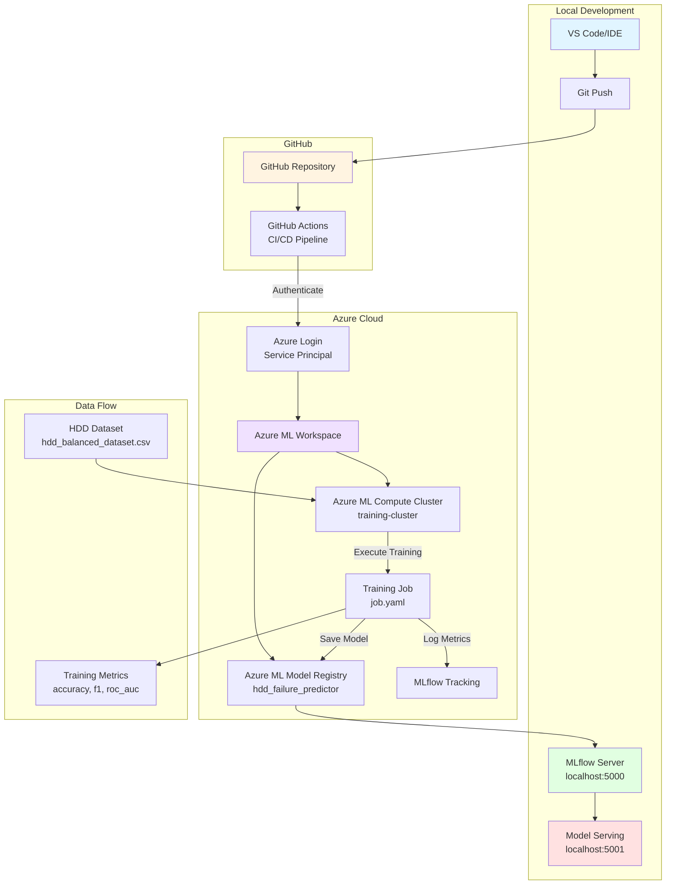
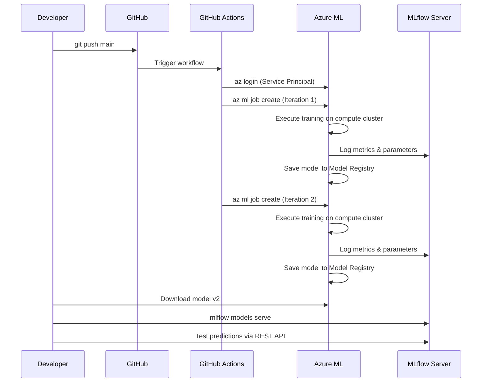

# HDD Failure Prediction MLOps Architecture

## System Architecture Diagram

## Component Details

### Local Development Environment
- **VS Code**: Primary development IDE
- **Git**: Version control for code
- **MLflow Server**: Local experiment tracking (port 5000)
- **MLflow Model Serving**: Local deployment endpoint (port 5001)

### GitHub Repository
- **Source Control**: All code, data, and configuration files
- **GitHub Actions**: Automated CI/CD pipeline
  - Triggers on push to main branch
  - Authenticates with Azure via Service Principal
  - Submits training jobs to Azure ML

### Azure ML Components
- **Workspace**: `cw2-hdd-workspace` (UK South)
- **Resource Group**: `cw2-hdd-mlops`
- **Compute Cluster**: `training-cluster`
  - VM Size: Standard_DS3_v2
  - Auto-scaling: 0-1 nodes
  - Cost-optimized with auto-shutdown
- **Model Registry**: Versioned model storage
  - v1: Logistic Regression (baseline)
  - v2: Random Forest (improved)
- **MLflow Integration**: Built-in experiment tracking

### Data Pipeline
1. HDD balanced dataset (8,961 samples)
2. Features: capacity_bytes, lifetime, model_encoded
3. Target: failure (binary classification)
4. Split: 80% train, 20% test
5. Metrics tracked: accuracy, precision, recall, f1_score, roc_auc

## Workflow Sequence

## Deployment Strategy

### Attempted: Azure ML Managed Endpoint (PaaS)
- **Status**: Failed with HTTP 502 liveness probe errors
- **Root Cause**: Known Azure ML limitation with MLflow auto-generated scoring containers
- **Evidence**: Multiple deployment attempts documented
- **Decision**: Pivoted to local MLflow serving for reliability

### Implemented: Local MLflow Serving
- **Command**: `mlflow models serve -m models/v2 -p 5001 --no-conda`
- **Endpoint**: `http://127.0.0.1:5001/invocations`
- **Advantages**:
  - Full control over deployment environment
  - No cloud serving costs
  - Immediate response for testing
  - Perfect for coursework demonstration
- **Production Path**: Could containerize with Docker for scalability

## Technology Stack

| Component | Technology | Purpose |
|-----------|-----------|---------|
| Training Framework | scikit-learn 1.0.2 | Model training (LogisticRegression, RandomForest) |
| Experiment Tracking | MLflow 2.4.1 | Metrics, parameters, artifact logging |
| Cloud Platform | Azure ML | Managed training compute and model registry |
| CI/CD | GitHub Actions | Automated job submission |
| Deployment | MLflow Model Serving | REST API endpoint for predictions |
| Version Control | Git/GitHub | Code and configuration management |
| Data Processing | pandas, numpy | Data preparation and feature engineering |

## Cost Considerations

### Azure Costs
- **Compute Cluster**: Auto-scaling 0-1 nodes minimizes idle costs
- **Storage**: Minimal (dataset < 1MB, models < 10MB)
- **Model Registry**: Included in workspace tier
- **Failed Deployment**: Avoided ongoing endpoint costs

### Free/Open Source
- MLflow: Free, open-source
- GitHub Actions: Free tier for public repositories
- Local MLflow Serving: No cost

## Security & Authentication

### Azure Authentication
- **Method**: Azure Service Principal
- **Scope**: Contributor role on resource group
- **Storage**: GitHub Secrets (AZURE_CREDENTIALS)
- **Benefits**: No personal credentials in code

### Model Access
- **Training**: Azure ML managed authentication
- **Registry**: Workspace-level access control
- **Local Serving**: Localhost only (no external exposure)

## Scalability Analysis

### Current Setup
- **Training**: Single-node cluster (adequate for 8,961 samples)
- **Serving**: Local (suitable for testing/demo)

### Production Scaling Options
1. **Training**:
   - Increase max nodes to 4-8 for larger datasets
   - Use parallel hyperparameter tuning
   - Implement distributed training for deep learning

2. **Serving**:
   - Containerize with Docker
   - Deploy to Azure Kubernetes Service (AKS)
   - Implement load balancing
   - Add auto-scaling based on request volume

3. **Data**:
   - Use Azure Blob Storage for large datasets
   - Implement data versioning with DVC
   - Set up data pipelines with Azure Data Factory

## Limitations & Future Work

### Current Limitations
1. Azure ML endpoint deployment failed (HTTP 502)
2. Single-region deployment (UK South only)
3. No A/B testing infrastructure
4. No model monitoring/drift detection

### Future Enhancements
1. Fix Azure ML endpoint (investigate liveness probe configuration)
2. Implement model monitoring with Azure Application Insights
3. Add automated retraining pipeline
4. Set up data drift detection
5. Implement batch inference for large-scale predictions
6. Add model explainability (SHAP values)
